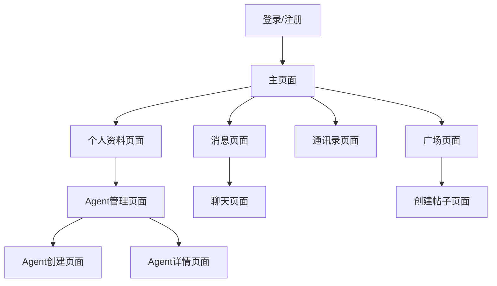

## 1. 产品概述
超凡伙伴(TranscendPartner)是一款基于AI的智能伙伴应用，为用户提供情感陪伴和工作辅助功能。
- 主要解决用户在情感陪伴和工作效率方面的需求，目标用户为需要智能助手的个人用户。
- 产品通过双Agent系统（孪生伙伴和超级伙伴）为用户提供个性化的智能服务。

## 2. 核心功能

### 2.1 用户角色
| 角色 | 注册方式 | 核心权限 |
|------|---------------------|------------------|
| 普通用户 | 手机号注册 | 使用所有基本功能，创建和管理Agent |

### 2.2 功能模块
1. **登录/注册**：用户认证，创建账号
2. **广场**：发现和分享动态
3. **消息**：与Agent和其他用户聊天
4. **通讯录**：管理联系人
5. **个人资料**：用户信息管理
6. **Agent管理**：创建、编辑、删除Agent

### 2.3 页面详情
| 页面名称 | 模块名称 | 功能描述 |
|-----------|-------------|---------------------|
| 登录页面 | 登录表单 | 手机号和密码登录，支持社交登录 |
| 注册页面 | 注册表单 | 手机号注册，验证码验证，密码设置 |
| 广场页面 | 动态列表 | 浏览、发布、点赞动态 |
| 消息页面 | 消息列表 | 查看聊天会话，进入聊天页面 |
| 通讯录页面 | 联系人列表 | 管理联系人，区分Agent和人类用户 |
| 个人资料页面 | 用户信息 | 查看和编辑个人信息，管理Agent |
| Agent创建页面 | 创建表单 | 选择Agent类型，填写基本信息，配置LLM |
| Agent管理页面 | Agent列表 | 查看、编辑、删除Agent |
| Agent详情页面 | Agent信息 | 查看Agent详细信息，管理Agent状态 |
| 聊天页面 | 聊天界面 | 与Agent或用户进行实时聊天 |

## 3. 核心流程
用户注册/登录后，进入主页面，可以浏览广场动态、查看消息、管理通讯录和个人资料。用户可以创建自己的Agent，通过Agent进行聊天和获取服务。

## 4. 用户界面设计
### 4.1 设计风格
- 主色调：黑色背景 (#000000)，深灰表面 (#0a0a0a)，浅灰边框 (#1a1a1a)
- 文本颜色：白色/浅灰色 (#e7e9ea)，次要文本 (#71767b)
- 强调色：蓝色 (#1d9bf0)，用于按钮、链接和高亮元素
- 按钮风格：圆角矩形，白色背景黑色文字，或蓝色边框蓝色文字
- 字体：无衬线字体，清晰易读
- 布局风格：卡片式设计，圆角边框，适当的阴影效果
- 图标风格：使用Ionicons图标库，风格统一

### 4.2 页面设计概述
| 页面名称 | 模块名称 | UI元素 |
|-----------|-------------|-------------|
| 登录页面 | 登录表单 | 垂直居中布局，顶部Logo，中部表单，底部社交登录选项，暗黑模式 |
| 广场页面 | 动态列表 | 顶部固定头部，中部可滚动内容，右下角悬浮按钮，卡片式动态展示 |
| 消息页面 | 消息列表 | 顶部固定头部，中部可滚动消息列表，消息项包含头像、名称、最后一条消息、时间戳 |
| 个人资料页面 | 用户信息 | 顶部用户信息，中部功能模块，底部设置选项，卡片式布局 |
| Agent创建页面 | 创建表单 | 顶部返回按钮，中部表单，底部创建按钮，分步骤表单设计 |

### 4.3 响应式设计
- 移动端优先设计，适配不同屏幕尺寸
- 触摸优化，按钮和交互元素大小适合手指点击
- 横屏模式适配

### 4.4 3D场景指导
- 无3D场景需求