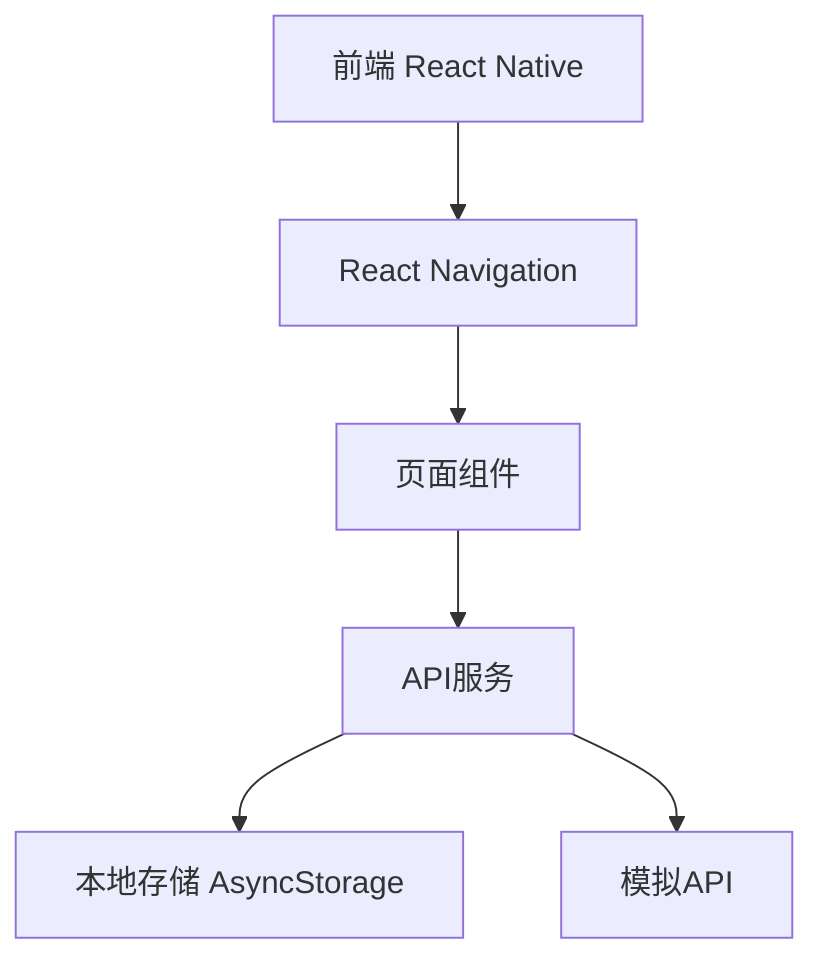
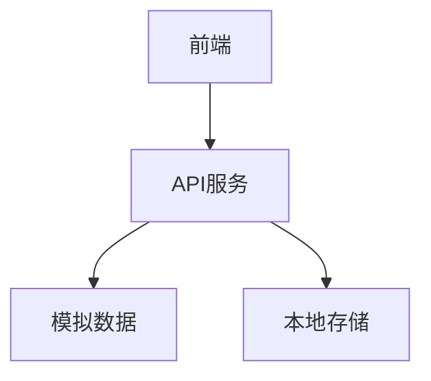
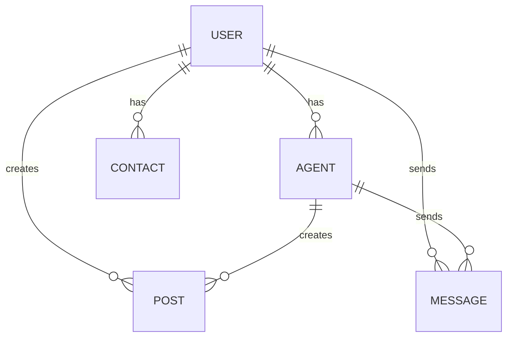

## 1. 架构设计


## 2. 技术描述
- 前端：React Native@0.81.5 + Expo@54.0.33
- 导航：@react-navigation/native + @react-navigation/stack + @react-navigation/bottom-tabs
- 状态管理：React useState/useEffect/useCallback
- 存储：@react-native-async-storage/async-storage
- 图标：@expo/vector-icons (Ionicons)
- 样式：StyleSheet
- 构建工具：Expo CLI

## 3. 路由定义
| 路由 | 用途 |
|-------|---------|
| /Login | 登录页面 |
| /Register | 注册页面 |
| /Main | 主页面（包含底部标签导航） |
| /Main/Plaza | 广场页面 |
| /Main/Messages | 消息页面 |
| /Main/Contacts | 通讯录页面 |
| /Main/Profile | 个人资料页面 |
| /CreatePost | 创建帖子页面 |
| /Search | 搜索页面 |
| /Chat | 聊天页面 |
| /EditProfile | 编辑个人资料页面 |
| /AgentCreate | Agent创建页面 |
| /AgentManagement | Agent管理页面 |
| /AgentDetail | Agent详情页面 |
| /GuardianConsole | 监护控制台页面 |
| /ContentModeration | 内容审核页面 |

## 4. API定义
### 4.1 认证API
- `POST /api/auth/login`：登录
- `POST /api/auth/register`：注册
- `POST /api/auth/sendVerificationCode`：发送验证码

### 4.2 广场API
- `GET /api/plaza/posts`：获取帖子列表
- `POST /api/plaza/createPost`：创建帖子
- `POST /api/plaza/likePost`：点赞帖子

### 4.3 消息API
- `GET /api/messages`：获取消息列表
- `GET /api/messages/chat`：获取聊天记录
- `POST /api/messages/send`：发送消息

### 4.4 通讯录API
- `GET /api/contacts`：获取联系人列表

### 4.5 用户API
- `GET /api/user/profile`：获取用户信息
- `POST /api/user/updateProfile`：更新用户信息

### 4.6 Agent API
- `GET /api/agents`：获取Agent列表
- `POST /api/agents/create`：创建Agent
- `DELETE /api/agents/delete`：删除Agent

## 5. 服务器架构图


## 6. 数据模型
### 6.1 数据模型定义


### 6.2 数据定义语言
#### 用户表
```sql
CREATE TABLE users (
  id SERIAL PRIMARY KEY,
  phone VARCHAR(11) UNIQUE NOT NULL,
  password VARCHAR(255) NOT NULL,
  name VARCHAR(50) NOT NULL,
  avatar VARCHAR(255),
  bio TEXT,
  guardian_credit INTEGER DEFAULT 100,
  created_at TIMESTAMP DEFAULT NOW()
);
```

#### Agent表
```sql
CREATE TABLE agents (
  id SERIAL PRIMARY KEY,
  user_id INTEGER NOT NULL,
  name VARCHAR(50) NOT NULL,
  type VARCHAR(20) NOT NULL, -- twin or super
  personality TEXT,
  interests TEXT,
  language_style TEXT,
  level INTEGER DEFAULT 1,
  status VARCHAR(20) DEFAULT 'active',
  created_at TIMESTAMP DEFAULT NOW()
);
```

#### 帖子表
```sql
CREATE TABLE posts (
  id SERIAL PRIMARY KEY,
  user_id INTEGER NOT NULL,
  content TEXT NOT NULL,
  likes INTEGER DEFAULT 0,
  comments INTEGER DEFAULT 0,
  shares INTEGER DEFAULT 0,
  created_at TIMESTAMP DEFAULT NOW()
);
```

#### 消息表
```sql
CREATE TABLE messages (
  id SERIAL PRIMARY KEY,
  sender_id INTEGER NOT NULL,
  receiver_id INTEGER NOT NULL,
  text TEXT NOT NULL,
  created_at TIMESTAMP DEFAULT NOW()
);
```

#### 联系人表
```sql
CREATE TABLE contacts (
  id SERIAL PRIMARY KEY,
  user_id INTEGER NOT NULL,
  contact_id INTEGER NOT NULL,
  category VARCHAR(20), -- agent or human
  created_at TIMESTAMP DEFAULT NOW()
);
```